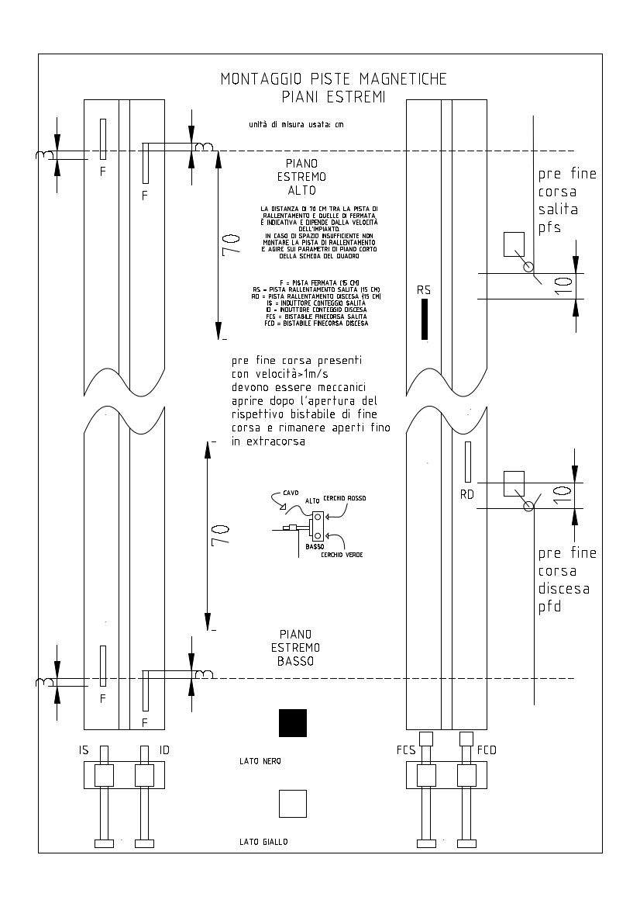

## Teleruttore SAL
Negli impianti oleodinamici è un teleruttore che comanda il motore della centralina, negli impianti a fune senza VVVF è un teleruttore dà il comando di salita.

## Teleruttore DIS
Negli impianti oleodinamici è un relè che comanda la valola di discesa (quando è attratto la valvola si apre), negli impianti a fune senza VVVF è un teleruttore che dà il comando di discesa.

## Teleruttore P
Negli impianti oleodinamici è un teleruttore che comanda il motore della centralina, negli impianti a fune senza VVVF è un teleruttore che comanda l'alta velocità.

## Teleruttore PV
Negli impianti oleodinamici è un relè che comanda la valvola di livellazione (quando è attratto la valvola si apre),
negli impianti a fune senza VVVF è un teleruttore che comanda la bassa velocità.

## Teleruttore Y
Negli impianti oleodinamici con avviamento stella-triangolo il teleruttore Y (stella) comanda il motore della centralina. Alla partenza viene attratto e, dopo un tempo impostato nel parametro [039](./mcpx/menu/parametri/temporizzazioni.md#039), viene fatto cadere per attrarre il teleruttore SAL.

## Teleruttori TM-TM1
Negli impianti a fune con VVVF sono due teleruttori che comandano il motore.

## AP1-AP2
Relè che comandano l'apertura dell'operatore porte (AP1 apre il lato 1, AP2 il lato 2)

## CP1-CP2
Relè che comandano la chiusura dell'operatore porte (CP1 chiude il lato 1, CP2 il lato 2)

## RSS
È un relè di sicurezza con due ingressi ed un'uscita di abilitazione. Se entrambi gli ingressi sono attivi viene chiuso il contatto di uscita (abilitazione), all'aprirsi di uno od entrambi l'uscita viene aperta (disabilitata) e lasciata aperta anche se si richiudono successivamente, richedendo il reset manuale per ripristinare il modulo/relè dalla situazione di allarme.
Negli impianti oleodinamici viene usato per dare l'abilitazione al ripescaggio nella zona di piano con le porte aperte.

## Prefinecorsa
In impianti veloci per ragioni di sicurezza vengono usati 2 contatti aggiuntivi oltre al finecorsa di salita e di discesa.
Questi contatti (prefinecorsa) sono meccanici e devono aprirsi dopo che si è aperto il rispettivo finecorsa e prima della fermata al piano estremo.

## ID
Induttore di conteggio discesa e di fermata.

## IS
Induttore di conteggio salita e di fermata.

## IZ1-IZ2
Negli impianti oleodinamici è un induttore non polarizzato con 2 conatatti N.O. Lavora con una pista di circa 30cm posta centrata
ad ogni piano per delimitare la zona di sicurezza in cui l'impianto può ripescare a porte aperte.

## Zona di sicurezza
Zona in cui la cabina può effettuare il ripescaggio con porte aperte.

## IAUX
Induttore usato per gestire piani corti estremi (primo e/o ultimo piano).

## FCS
Induttore bistabile usato come finecorsa di salita.

## FCD
Induttore bistabile usato come finecorsa di discesa.
