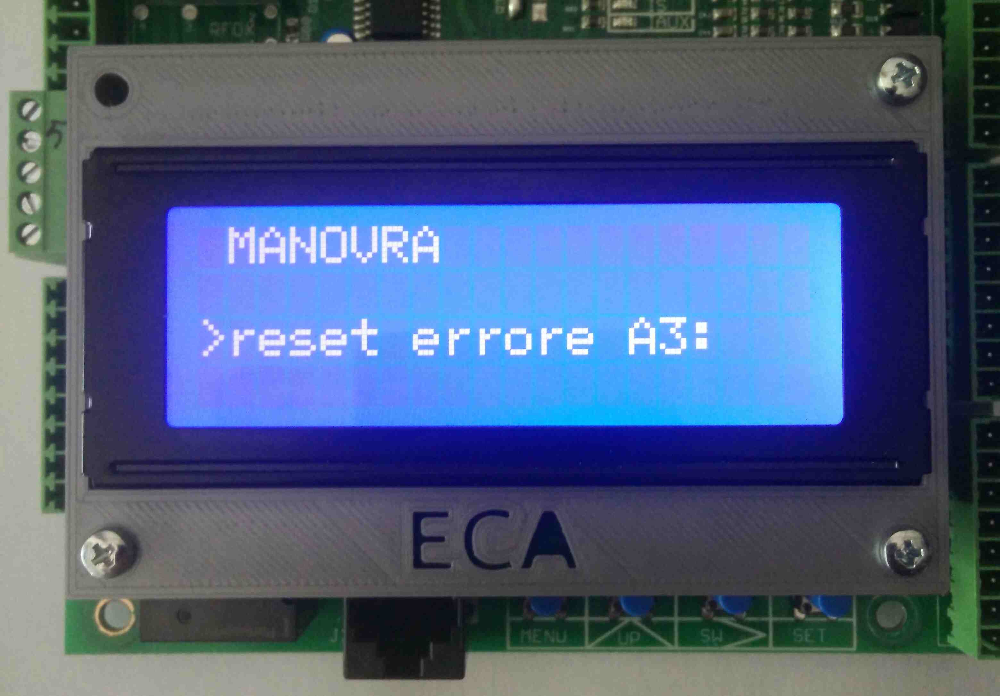

# Comandi

Di seguito viene riportato l'elenco dei comandi disponibili e le loro funzioni.

## Esclusione apertura porte (esclus aperture) {#escl-apert}

Esclusione apertura delle porte. Può risultare utile usare questo comando nel caso in cui si vuole fare delle prove
ed impedire l'accesso in cabina agli utenti.

Valore impostato|Effetto
--|--
S|Le porte non vengono mai aperte
N|Le porte vengono comandate normalmente

## Tuning VVVF (tuning vvvf) {#tun-vvvf}

Attrae i teleruttori di marcia per preparazione alla procedura di tuning del vvvf.
Le __serie devono essere chiuse__ affinchè il comando funzioni.

Valore impostato|Effetto
--|--
S|I teleruttori si attraggono
N|I teleruttori cadono

## Adeguamento EN81-20

Attiva adeguamento a normativa EN81-20

Valore impostato|Effetto
--|--
S|Adeguamento attivato
N|Adeguamento non attivato

## Reset errore A3 (reset errore a3) {#res-err-a3}

Azzera gli errori relativi alla gestione emendamento A3.

Valore impostato|Effetto
--|--
S|L'errore viene resettato
N|L'errore non viene resettato

## Reset extracorsa (res extracorsa) {#res-extra}

Resetta l'errore di extracorsa in __impianti oleodinamici__.

Vedi errore [008](../../errori/elenco.md#008).

Valore impostato|Effetto
--|--
S|L'errore viene resettato
N|L'errore non viene resettato

## Reset errori (reset errori) {#res-err}

Azzera l'elenco degli errori.

Valore impostato|Effetto
--|--
S|L'elenco viene azzerato
N|L'elenco non viene azzerato

## Memorizzazione indirizzo periferica (memor ind perif) {#mem-ind}

Avvia la procedura di memorizzazione di una scheda PER16B-SMD.

Valore impostato|Effetto
--|--
S|La procedura viene avviata
N|La procedura non viene avviata

#### Procedura memorizzazione

Una scheda PER16B-SMD alla volta può essere memorizzata. Prima di iniziare assicurarsi di aver collegato la scheda PER16B-SMD alla scheda MCP2015X-SMD come mostrato in foto.

Dopo aver selezionato S nella voce del menu, verrà presentata la seguente schermata.

Impostare l'indirizzo della scheda desiderato (vedi [elenco indirizzi periferiche e relative funzioni](../../../../periferiche/indirizzi.md)), utilizzando il tasto UP per modificare il valore puntato dal cursore, SW per spostare il cursore orizzontalmente, SET per impostare e MENU per uscire.

Se tutto è andato a buon fine verrà presentata la schermata

Dopo essere usciti, per rendere le modifiche attive bisogna __resettare la scheda MCP2015X-SMD__ (vedi [reset sistema](#reset-sistema)).

##### Periferica già programmata

Se la scheda PER16B-SMD è stata già programmata, nella schermata di memorizzazione verrà visualizzato l'indirizzo corrente.

È possibile a questo punto __modifcare__ l'indirizzo, tenendo a mente che __non è possibile memorizzare due schede con lo  stesso indirizzo__.
In tal caso la procedura fallisce.

## Reset sistema (RESET SISTEMA) {#reset-sistema}

Riavvia il firmware.

Valore impostato|Effetto
--|--
S|La scheda viene riavviata
N|La scheda non viene riavviata

## Chiamate da pulsanti (chiamate da pulsanti up-sw-set) {#ch-puls}

Permette di effettuare chiamate ad un piano specifico selezionato con i pulsanti UP, SW, SET.

Valore impostato|Effetto
--|--
S|Le chiamate da pulsanti sono attivate
N|Le chiamate da pulsanti non sono attivate
