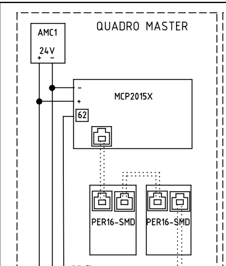

# Introduzione

MCP2015X-SMD è la scheda madre del quadro elettrico mcpx e gestisce tutte le funzioni principali di gestione della manovra
dell'impianto elevatore.
Il numero di parametri di cui è fornita permettono una ampia libertà di configurazione, mentre la diagnostica guasti permette di concoscere esattamente la situazione in cui
si trovava la cabina al momento di un errore.

I tipi di manovra che gestisce sono vari:
*   manovra universale
*   manovra a prenotazione simplex
*   manovra a prenotazione duplex
*   manovra a prenotazione triplex
*   manovra a prenotazione quadruplex
*   manovra pompieri
*   manovra a chiamate prioritarie o selettive

Può gestire sia impianti a fune che oleodinamici.

PER16B-SMD è una scheda periferica che complementa MCP2015X-SMD con molte funzionalità, tipo:
*   comando luminose varie
*   ingressi per prenotazioni o chiamate
*   comando di display di vario tipo

Per impostare le varie funzioni disponibili, PER16B-SMD viene programmata con un indirizzo specifico (vedi lista [indirizzi e funzioni](periferiche/indirizzi.md)).

MCP2015X-SMD e PER16B-SMD comunicano tramite un bus seriale. Il numero massimo di periferiche che possono essere presenti sul bus è 48.

Per il corretto funzionamento è necessario che sul bus sia collegata almeno una periferica che gestisca le chiamate dell'impianto.

Per impianti collegati in batteria (duplex, triplex etc) e/o comunicazione con scheda esterna per telecontrollo o altre applicazioni MCP2015X-SMD usa un altro bus seriale dedicato.

In totale vengono utilizzati quindi 2 bus seriali:

* uno "locale" che gestisce la comunicazione interna tra quadro e periferiche
* uno "esterno" che gestisce la comunicazione con altri quadri o altre schede

Una spiegazione più dettagliata viene data nel capitolo ["Comunicazioni seriali"](./bus_seriali/README.md).

## Firmware

Il nome del firmware presente sulle schede è `P`.

Le versioni compatibili con questo manuale sono dalla 0.0.30 in poi.
Vedi parametro [154](./mcpx/menu/parametri/manovra.md#154) per controllare la versione del firmware, il valore dovrebbe essere almeno `P000030`.

Permette la gestione della cabina in seriale e parallelo e del vano in parallelo, ma non permette una gestione in seriale di tutto l'impianto.
