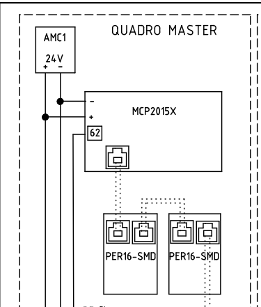
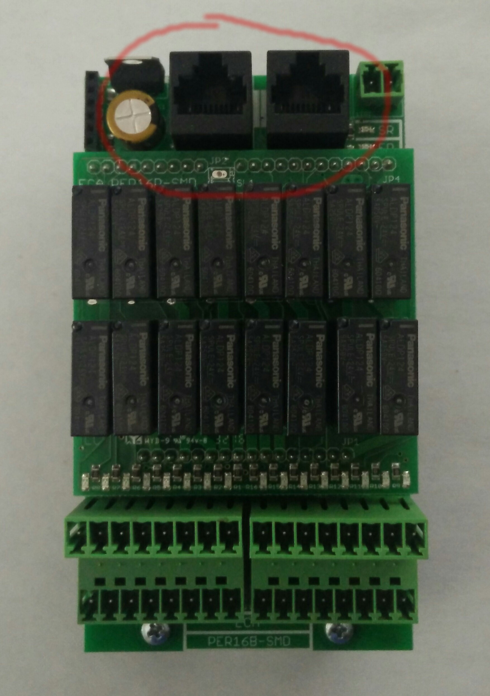
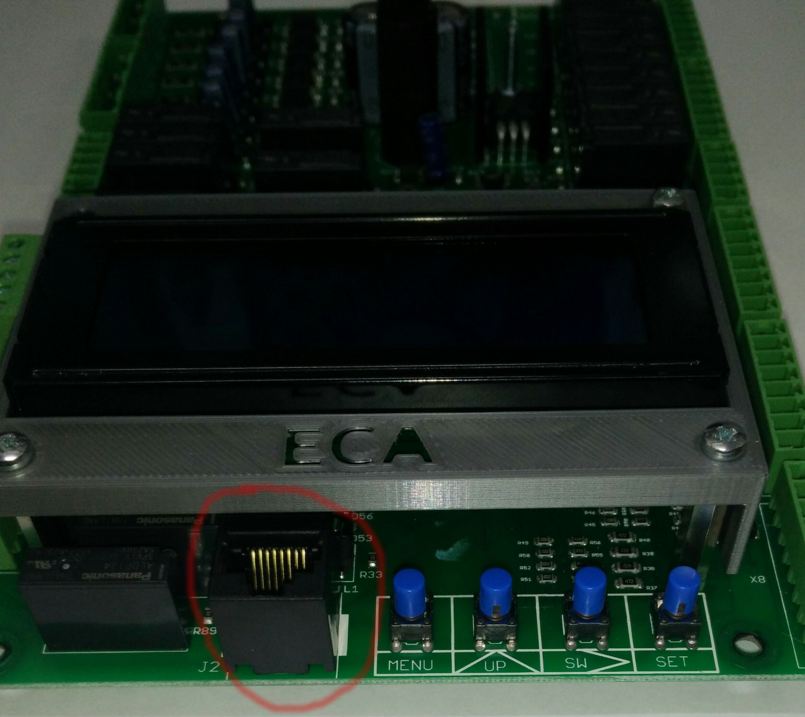
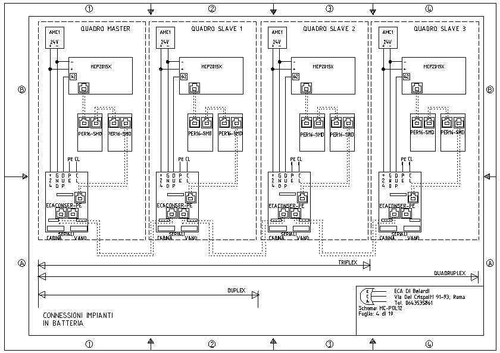

# Comunicazioni seriali

La scheda MCP2015X-SMD presenta 2 bus seriali, uno per comunicare "localmente" con le periferiche,
l'altro per comunicare "esternamente" con altri quadri o schede. Per comodità chiameremo il primo "bus locale" e il secondo "bus esterno".

Entrambi lavorano su una linea differenziale di 24VDC.
Viene usato un cavo unico con connettore RJ45 per il collegamento.

## Bus locale

Questa linea collega una scheda MCP2015X-SMD con al massimo 48 schede periferiche PER16B-SMD e viene usata per le funzioni di manovra della scheda/quadro di manovra.
La scheda madre ha in dotazione solo un connettore che rappresenta il punto di partenza per le connessioni. Ogni scheda periferica ha 2 connettori, uno per "entrare" ed uno per "uscire" che possono essere utilizzati in maniera interscambiabile.

## Bus esterno

Questa linea collega più schede madri (MCP2015X-SMD)/quadri di manvora fino ad un massimo di 4 e viene usata per la gestione di impianti in batteria (duplex, triplex, quadruplex).

Si usa una scheda apposita per collegare i vari nodi. La scheda è ECACONSER-PE.

Il cavo è lo stesso del bus locale. Dall'ultima periferica di un quadro parte il cavo di collegamento che va alla ECACONSER-PE. Una scheda ECACONER-PE collega due schede madri/quadri di manovra tramite due connettori che possono essere usati in maniera interscambiabile.

