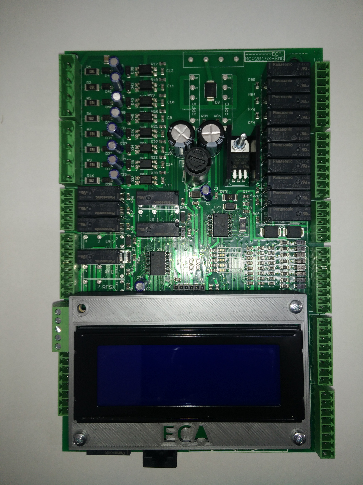
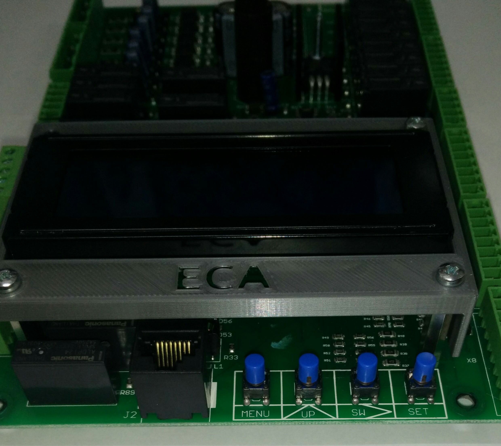

# Scheda MCP2015X-SMD

Come già anticipato nell'introduzione, MCP2015X-SMD è la scheda madre del quadro elettrico mcpx.

Sotto al display LCD ci sono quattro pulsanti che permettono l'utilizzo dell'interfaccia utente:

Nome pulsante|Funzione
---|---
MENU|Permette di accedere al menu
UP|Muove il cursore dello schermo verticalmente verso il basso o modifica il valore numerico di un parametro
SW|Muove il cursore dello schermo verso destra
SET|Tasto di invio/conferma

In base all'input dell'utente o allo stato dell'impianto vengono distinti 3 stati di funzionamento:
*   [MENU](./menu/README.md)
*   [MANOVRA](./manovra/README.md)
*   [BLOCCO PER ERRORE](./blocco_errore/README.md)
