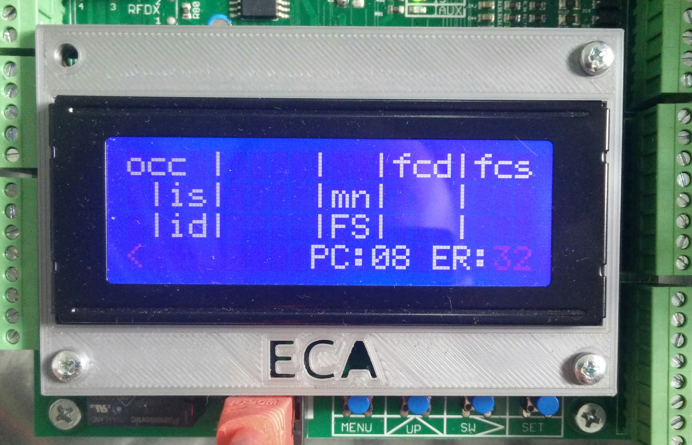
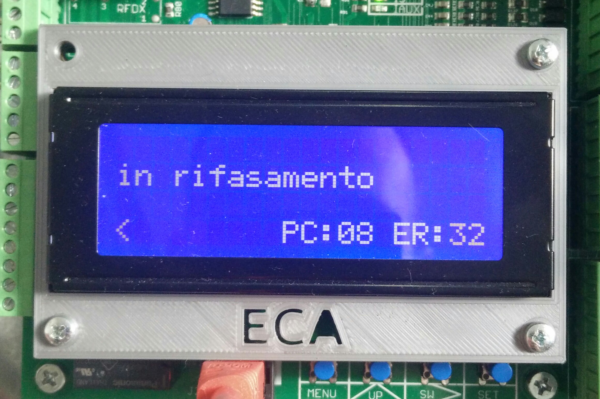
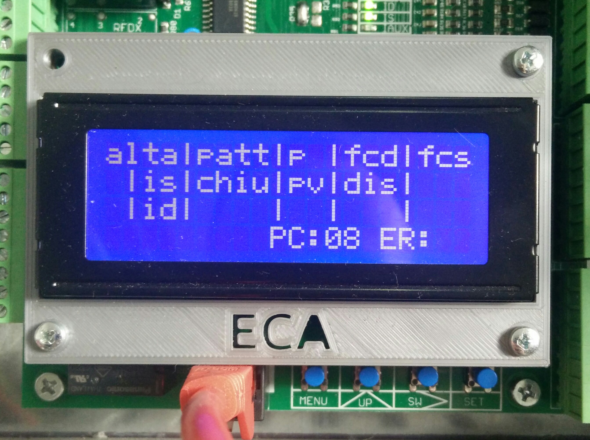
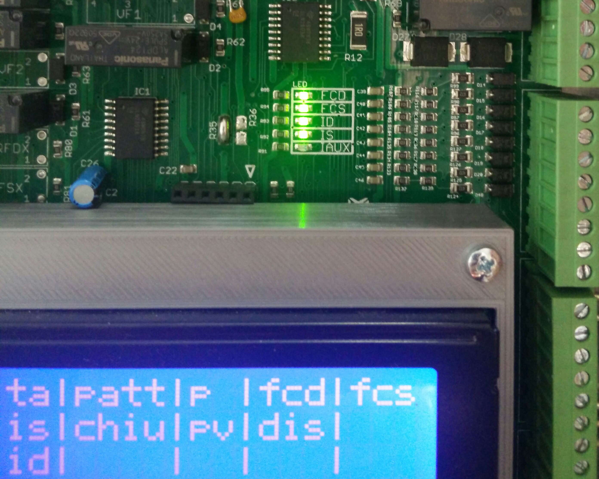

# Manovra

La modalità di manovra è quella che attiva la gestione dell'ascensore. Appena si accende la scheda questa è la modalità che viene attivata.

Viene presentata a schermo una pagina con lo stato del quadro di manovra.



Sempre all'accensione, la prima cosa che viene effettuata è un rifasamento dell'impianto (se questo non è messo in manutenzione).

In questo caso si alterna la pagina con lo stato dell'impianto e la segnalazione di rifasamento.

 

La pagina di stato del quadro ha la seguente struttura

```
alta|stop|pv|fcd|fcs
a|is|ap12|mn|dis|ccp
x|id|cm12|fm|svr|prr
< >      PC:00 ER:00
```

in cui si distinguono 10 zone (numerate da 1 a 10) che vengono usate per visualizzare più informazioni in maniera alternata

```
1   |2   |3 |fcd|fcs
a|is|4   |mn|5  |6
x|id|cm12|7 |8  |prr
9 10     PC:00 ER:00
```

#### Zona 1

```
1   |2   |3 |fcd|fcs
a|is|4   |mn|5  |6
x|id|cm12|7 |8  |prr
9 10     PC:00 ER:00
```

In questa zona vengono fornite le seguenti informazioni

Informazione|Descrizione
---|---
alta|attivato il comando di alta velocità
vman|attivato il comando di velocità di manutenzione (in impianti a fune con VVVF)
occ|attivato occupato
tstz|in attesa di prenotazioni (in impianti a prenotazione)
atm1|attivato il timer 1 per la gestione del piano corto 2 (vedi [parametro 17](../menu/parametri/temporizzazioni.md#017))
atm2|attivato il timer 2 per la gestione del piano corto 3 (vedi [parametro 18](../menu/parametri/temporizzazioni.md#018))
atm3|attivato il timer 3 per la gestione del piano corto 4 (vedi [parametro 19](../menu/parametri/temporizzazioni.md#019))
atm4|attivato il timer 4 per la gestione del piano corto 5 (vedi [parametro 20](../menu/parametri/temporizzazioni.md#020))
atm5|attivato il timer 5 per la gestione del piano lungo 1 (vedi [parametro 21](../menu/parametri/temporizzazioni.md#021))
atm6|attivato il timer 6 per la gestione del piano lungo 2 (vedi [parametro 22](../menu/parametri/temporizzazioni.md#022))
A-R!|errore nel comando dei timer dei piani corti

#### Zona 2

```
1   |2   |3 |fcd|fcs
a|is|4   |mn|5  |6
x|id|cm12|7 |8  |prr
9 10     PC:00 ER:00
```

In questa zona vengono fornite le seguenti informazioni

Informazione|Descrizione
---|---
stop|attivato il comando di stop (questo comando viene dato alla fermata o in presenza di errori)
patt|attivato il comando del pattino retrattile

#### Zona 3

```
1   |2   |3 |fcd|fcs
a|is|4   |mn|5  |6
x|id|cm12|7 |8  |prr
9 10     PC:00 ER:00
```

In questa zona vengono fornite le seguenti informazioni

Informazione|Descrizione
---|---
pv|attivato il comando del teleruttore PV e il teleruttore è attratto
p|attivato il comando del teleruttore P e il teleruttore è attratto

#### Zona 4

```
1   |2   |3 |fcd|fcs
a|is|4   |mn|5  |6
x|id|cm12|7 |8  |prr
9 10     PC:00 ER:00
```

In questa zona vengono fornite le seguenti informazioni

Informazione|Descrizione
---|---
ap12|attivato il comando di apertura porte lato 1 o 2 (od entrambi, a seconda di come è stato impostata l'apertura al piano)
ap_c|rilevato relè apertura porte difettoso (la scheda ha dato il comando ma il relè non si è attratto)
chiu|attivato il comando di chiusura porte

#### Zona 5

```
1   |2   |3 |fcd|fcs
a|is|4   |mn|5  |6
x|id|cm12|7 |8  |prr
9 10     PC:00 ER:00
```

In questa zona vengono fornite le seguenti informazioni

Informazione|Descrizione
---|---
dis|attivato il comando di discesa (in impianti a fune con VVVF) e il teleruttore DIS è attratto (in impianti a fune senza VVVF e oleo)
sal|attivato il comando di salita (in impianti a fune con VVVF) e il teleruttore SAL è attratto (in impianti a fune senza VVVF e oleo)
ste|attivato il comando di stella e il teleruttore di stella Y è attratto
]aa|i contatti del freno sono aperti (impianti a fune con VVVF ed emendamento A3)
]cc|i contatti del freno sono chiusi (impianti a fune con VVVF ed emendamento A3)
]ac|il contatto 1 del freno è aperto (impianti a fune con VVVF ed emendamento A3)
]ca|il contatto 2 del freno è aperto (impianti a fune con VVVF ed emendamento A3)

#### Zona 6

```
1   |2   |3 |fcd|fcs
a|is|4   |mn|5  |6
x|id|cm12|7 |8  |prr
9 10     PC:00 ER:00
```

In questa zona vengono fornite le seguenti informazioni

Informazione|Descrizione
---|---
ccp|il contatto di cabina completa è chiuso (in impianti a prenotazione)
ste|attivato il comando di stella e il teleruttore di stella Y è attratto
]aa|i contatti del freno sono aperti (impianti a fune 1-2 velocità ed emendamento A3)
]cc|i contatti del freno sono chiusi (impianti a fune 1-2 velocità ed emendamento A3)
]ac|il contatto 1 del freno è aperto (impianti a fune 1-2 velocità ed emendamento A3)
]ca|il contatto 2 del freno è aperto (impianti a fune 1-2 velocità ed emendamento A3)

#### Zona 7

```
1   |2   |3 |fcd|fcs
a|is|4   |mn|5  |6
x|id|cm12|7 |8  |prr
9 10     PC:00 ER:00
```

In questa zona vengono fornite le seguenti informazioni

Informazione|Descrizione
---|---
fm|è intervenuto il fondo mobile
FS|attivato il fuori servizio

#### Zona 8

```
1   |2   |3 |fcd|fcs
a|is|4   |mn|5  |6
x|id|cm12|7 |8  |prr
9 10     PC:00 ER:00
```

In questa zona vengono fornite le seguenti informazioni

Informazione|Descrizione
---|---
svr|è intervenuto il sovraccarico
xPA|spinto pulsante apertura porte in manovra pompieri

#### Zona 9

```
1   |2   |3 |fcd|fcs
a|is|4   |mn|5  |6
x|id|cm12|7 |8  |prr
9 10     PC:00 ER:00
```

In questa zona vengono fornite informazioni riguardo la comunicazione seriale con le periferiche

Informazione|Descrizione
---|---
< (lampeggiante)|la comunicazione seriale con le periferiche funziona regolarmente
X (lampeggiante)|non sono presenti periferiche sul bus seriale
A (lampeggiante)|la comunicazione seriale è stata azzerata per il verificarsi di un errore
E (lampeggiante)|errore di comunicazione con una periferica (segue informazione successiva)
00 (lampeggiante)|l'indirizzo della periferica che ha problemi di comunicazione (è un numero che va da 00 a 48, vedi [indirizzi periferiche](../../periferiche/indirizzi.md))

#### Zona 10

```
1   |2   |3 |fcd|fcs
a|is|4   |mn|5  |6
x|id|cm12|7 |8  |prr
9 10     PC:00 ER:00
```

In questa zona vengono fornite informazioni riguardo la comunicazione seriale esterna con altri quadri collegati in batteria e telecontrollo.

Informazione|Descrizione
---|---
> (lampeggiante)|la comunicazione seriale con i quadri e scheda esterna funziona regolarmente
A (lampeggiante)|la comunicazione seriale è stata azzerata per il verificarsi di un errore
C (lampeggiante)|ci sono errori nella comunicazione seriale
E (lampeggiante)|ci sono errori nel protocollo di comunicazione seriale
Z (lampeggiante)|ci sono errori nelle istruzioni del protocollo seriale

A seguire, in caso di errori, vengono visualizzati i quadri interessati e/o la scheda esterna per telecontrollo nella seguente maniera

```
123EX
```

dove

* `1` indica il quadro slave con indirizzo 2
* `2` indica il quadro slave con indirizzo 3
* `3` indica il quadro slave con indirizzo 4
* `EX` indica la scheda esterna per telecontrollo

#### Altre informazioni

Le altre informazioni presentate in ordine riga per riga

Informazione|Descrizione
---|---
fcd|il finecorsa di discesa FCD è chiuso
fcs|il finecorsa di salita FCS è chiuso
is|l'induttore di conteggio/fermata salita IS è chiuso
mn|l'interruttore di manutenzione è chiuso (l'impianto è in manutenzione)
id|l'induttore di conteggio/fermata discesa ID è chiuso
cm12|è intervenuta la costola mobile/fotocellula del lato 1 o 2
FS|è attivato il fuori servizio
prr|il pulsante di partenza rapida è spinto (impianti a prenotazione)
PC:00|posizione della cabina (00 è il numero del piano e può andare da 00 a 31)
ER:00|numero di errori che si sono verificati (__non è un codice di errore__, 00 è un numero che va da 00 a 32), vedi [lista errori](../menu/errori/README.md)


A cavallo tra la riga 2 e 3 viene segnalato

```
a|
x|
```

se l'induttore IAUX per gestione dei piani corti estremi è chiuso.

Lo stato degli induttori e dei finecorsa viene riportato, oltre che sul display, anche su led appositi sulla scheda


