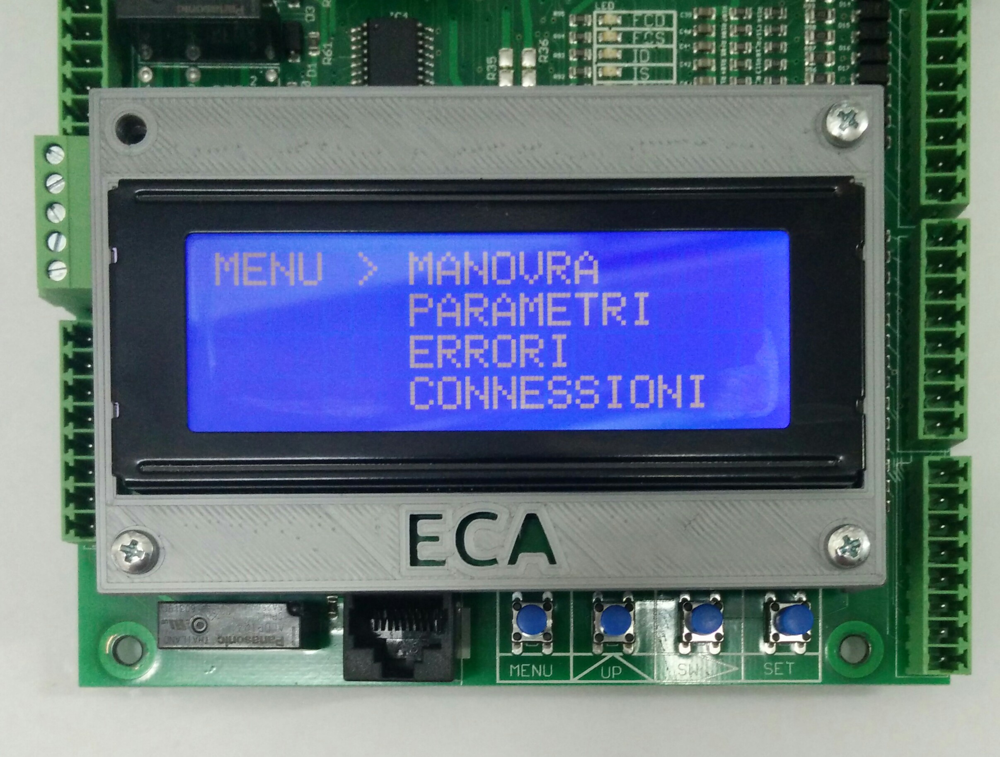

# Menu

Premendo per circa 4 secondi il tasto MENU si accede all finestra del menu.

Questa presenta 4 voci:
*   MANOVRA
*   PARAMETRI
*   ERRORI
*   CONNESSIONI

Premendo il tasto UP si muove il cursore lungo le varie voci, premendo il tasto SET si entra
nella voce selezionata.
