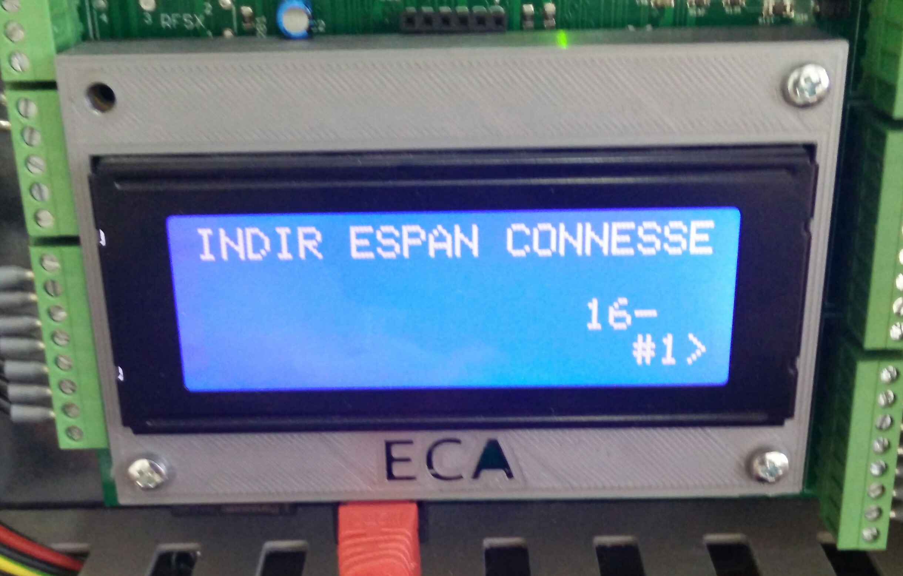
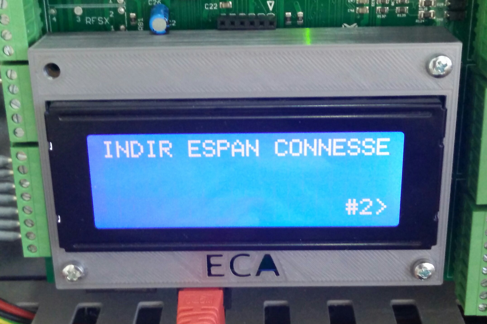
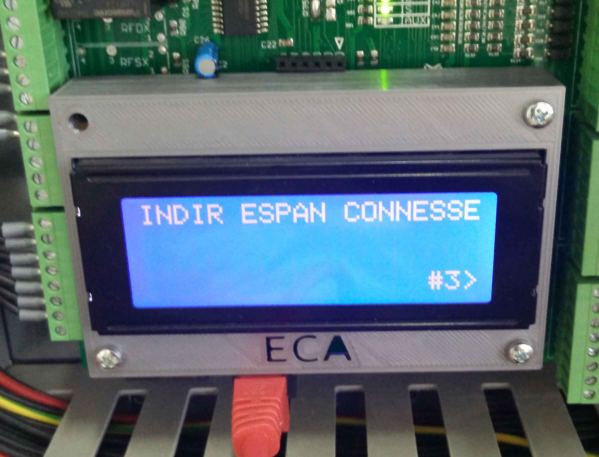
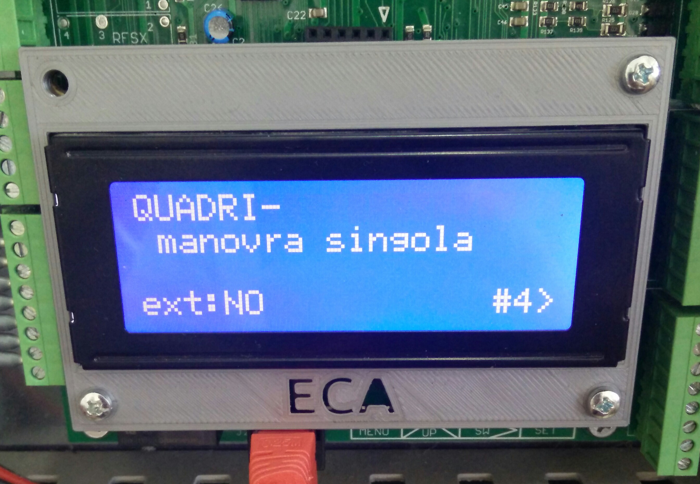

# Connessioni

Nella sezione connessioni vengono elencate tutte le connessioni attiva sul bus, (ovvero tutte le schede periferiche PER16B-SMD che vengono riconosciute all'accensione), il tipo di manovra impostata ed eventuali connessioni esterne.

Vengono presentate 4 pagine che è possibile scorrere premendo il tasto UP.

Le prime tre elencano le periferiche connesse (che possono arrivare fino a 48). Ogni periferica viene identificata tramite il numero del suo indirizzo. Ogni numero viene separato dal carattere `-`.

 
 

Nell'esempio precedente si può vedere che nel bus è memorizzata solo una perifierica
con indirizzo 16, che il quadro è impostato per funzionare con manovra singola (cioè universale), non ha comunicazione esterna per telecontrollo attiva (segnalato dalla voce `ext:NO`). Al momento della stesura del manuale la comunicazione per telecontrollo non è supportata, mentre i valori possibili per il tipo di manovra riportato nella pagina 4 sono:

* manovra singola (manovra universale)
* master (manovra a prenotazione)
* slave (manovra a prenotazione)
