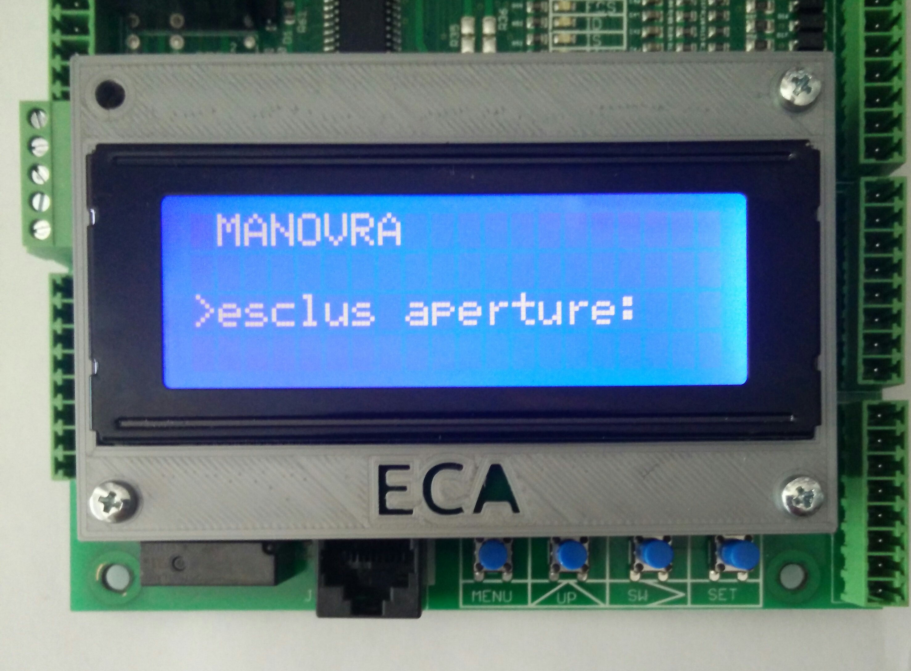
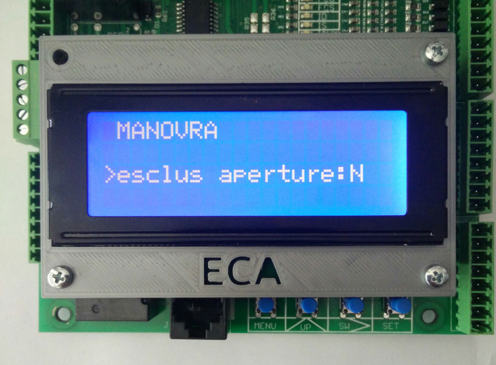
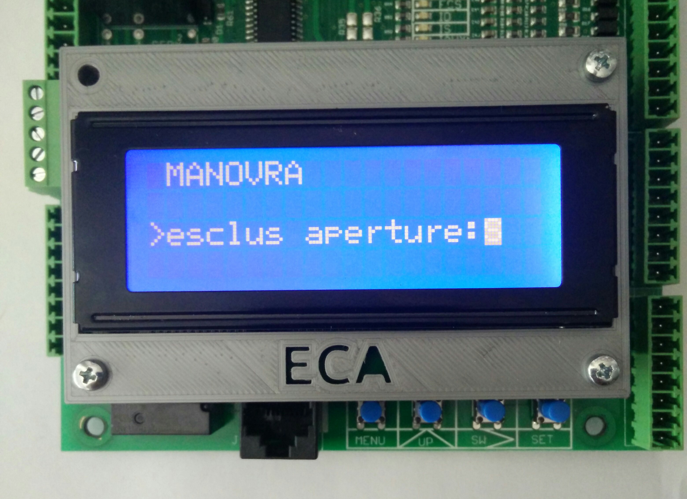

# Manovra

In questa voce si trovano dei comandi che permettono di cambiare il comportamento del quadro,
resettare situazioni di blocco oppure effettuare procedure particolari.
Questi comandi accettano due possibili valori:

Nome valore|Descrizione
---|---
S|Significa `SI`
N|Sigifica `NO`

Ad esempio, la prima voce visualizzata è

che esclude l'apertura porte.
Il testo tra `>` e `:` è il nome del comando.

Premendo il tasto SET si seleziona il comando e alla destra di `:` compare il valore salvato, in questo caso N, cioè NO.

Premendo il tasto UP compare a schermo il cursore che permette la selezione del valore. Si può scegliere tra S e N

Premendo SET il valore viene memorizzato e il comando viene attuato. La voce visualizzata a schermo ritorna alla
situazione iniziale.
