# Comandi

Di seguito viene riportato l'elenco dei comandi disponibili e le loro funzioni.

## Esclusione apertura porte (esclus aperture) {#escl-apert}

Esclusione apertura delle porte.

Valore impostato|Effetto
--|--
S|Le porte non vengono mai aperte
N|Le porte vengono comandate normalmente

## Tuning VVVF (tuning vvvf) {#tun-vvvf}

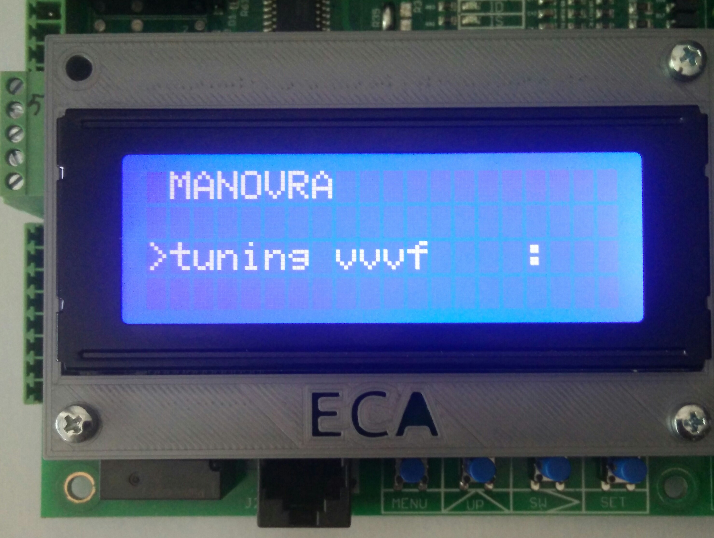

Attrae i teleruttori di marcia per preparazione alla procedura di tuning del vvvf.

Valore impostato|Effetto
--|--
S|I teleruttori si attraggono
N|I teleruttori cadono

## Manovra da pulsanti (manovra da pulsanti up-sw) {#man-puls}

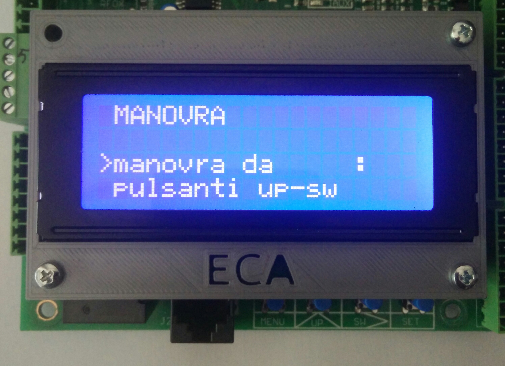

Abilita il comando di movimento in manovra tramite i pulsanti UP e SW della scheda.

Valore impostato|Effetto
--|--
S|La manovra da pulsanti è attiva
N|La manvora da pulsanti non è attiva

--- Inserire spiegazione funzionamento manovra da pulsanti con foto ---
## Reset errore A3 (reset errore a3) {#res-err-a3}

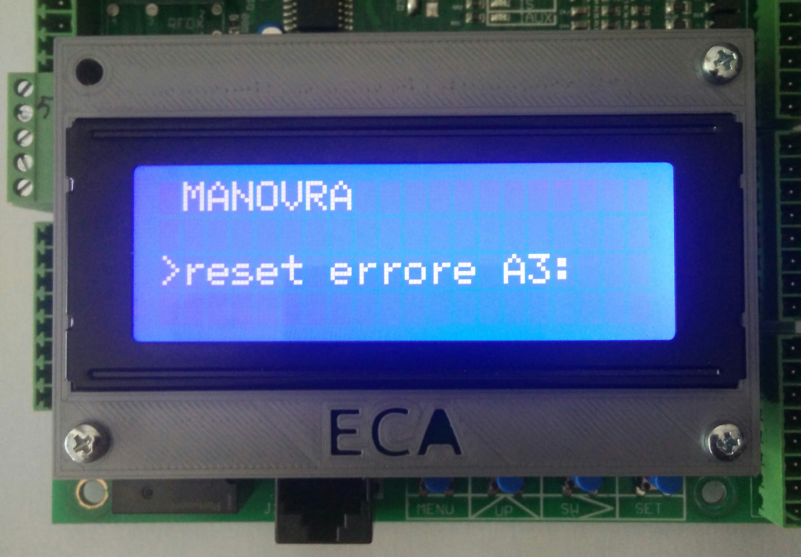

Resetta l'errore del modulo che gestisce movimento incontrollato cabina in base all'emendamento A3.

Vedi errori [101](../../errori/elenco.md#101) e [102](../../errori/elenco.md#102).

Valore impostato|Effetto
--|--
S|L'errore viene resettato
N|L'errore non viene resettato

## Reset extracorsa (res extracorsa) {#res-extra}

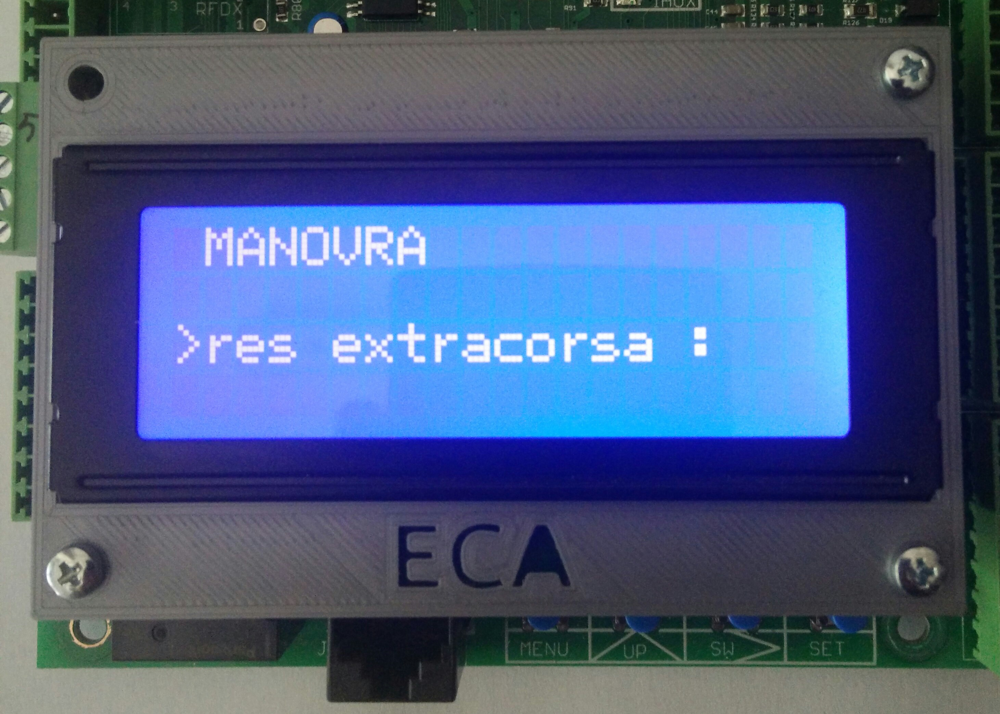

Resetta l'errore di extracorsa.

Vedi errore [008](../../errori/elenco.md#008).

Valore impostato|Effetto
--|--
S|L'errore viene resettato
N|L'errore non viene resettato

## Reset errori (reset errori) {#res-err}

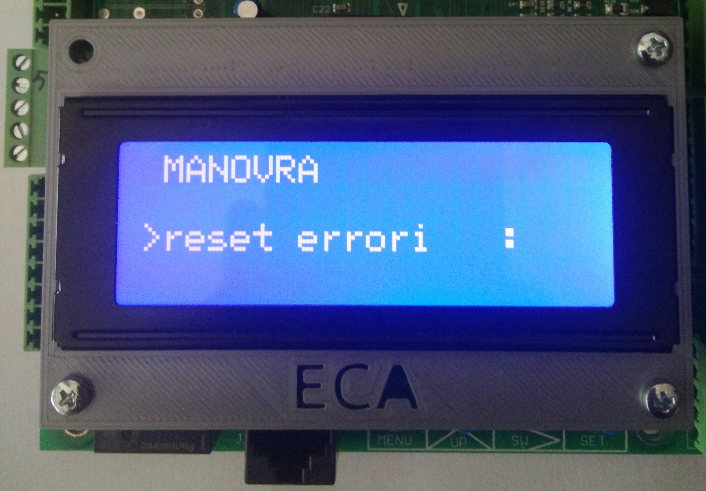

Azzera l'elenco degli errori.

Valore impostato|Effetto
--|--
S|L'elenco viene azzerato
N|L'elenco non viene azzerato

## Memorizzazione indirizzo periferica (memor ind perif) {#mem-ind}

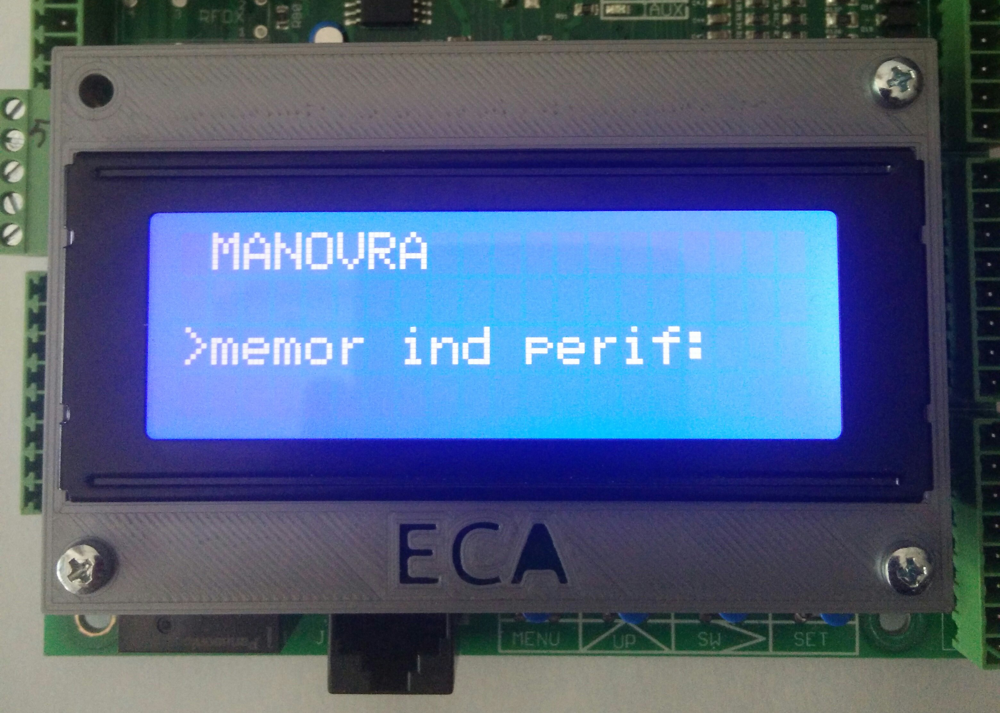

Avvia la procedura di memorizzazione di una scheda PER16B-SMD.

Valore impostato|Effetto
--|--
S|La procedura viene avviata
N|La procedura non viene avviata

#### Procedura memorizzazione

Una scheda PER16B-SMD alla volta può essere memorizzata. Prima di iniziare assicurarsi di aver collegato la scheda PER16B-SMD alla scheda MCP2015X-SMD come mostrato in foto.

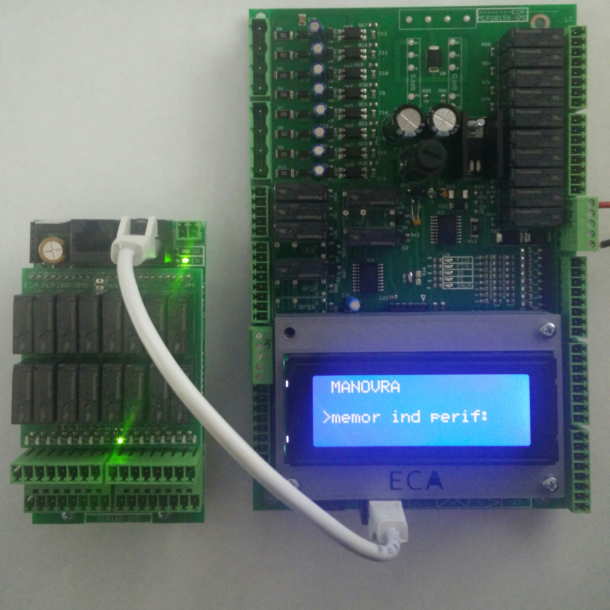

Dopo aver selezionato S nella voce del menu, verrà presentata la seguente schermata.

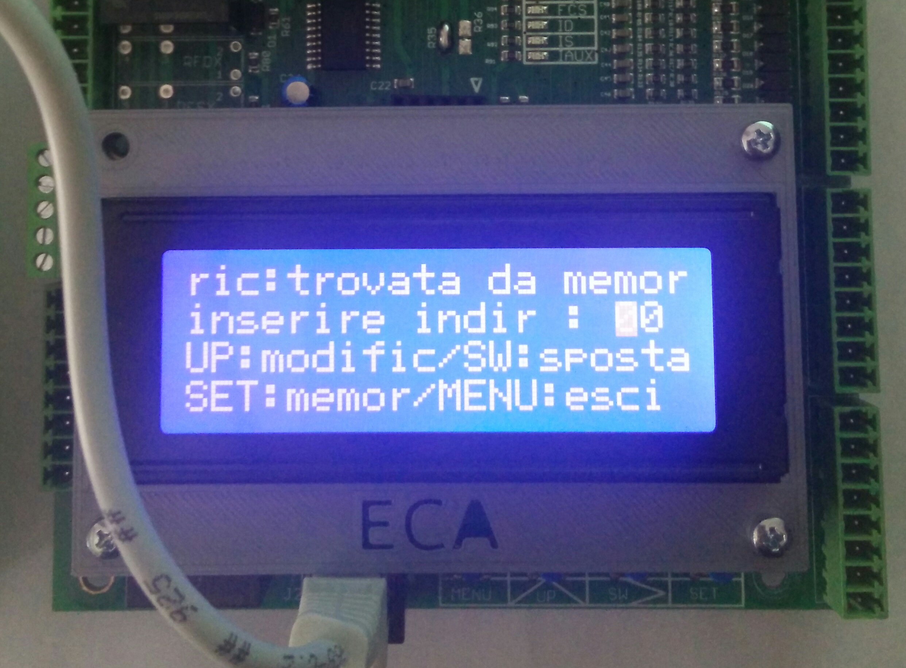

Impostare l'indirizzo della scheda desiderato (vedi [elenco indirizzi periferiche e relative funzioni](../../../../periferiche/indirizzi.md)), utilizzando il tasto UP per modificare il valore puntato dal cursore, SW per spostare il cursore orizzontalmente, SET per impostare e MENU per uscire.

Se tutto è andato a buon fine verrà presentata la schermata

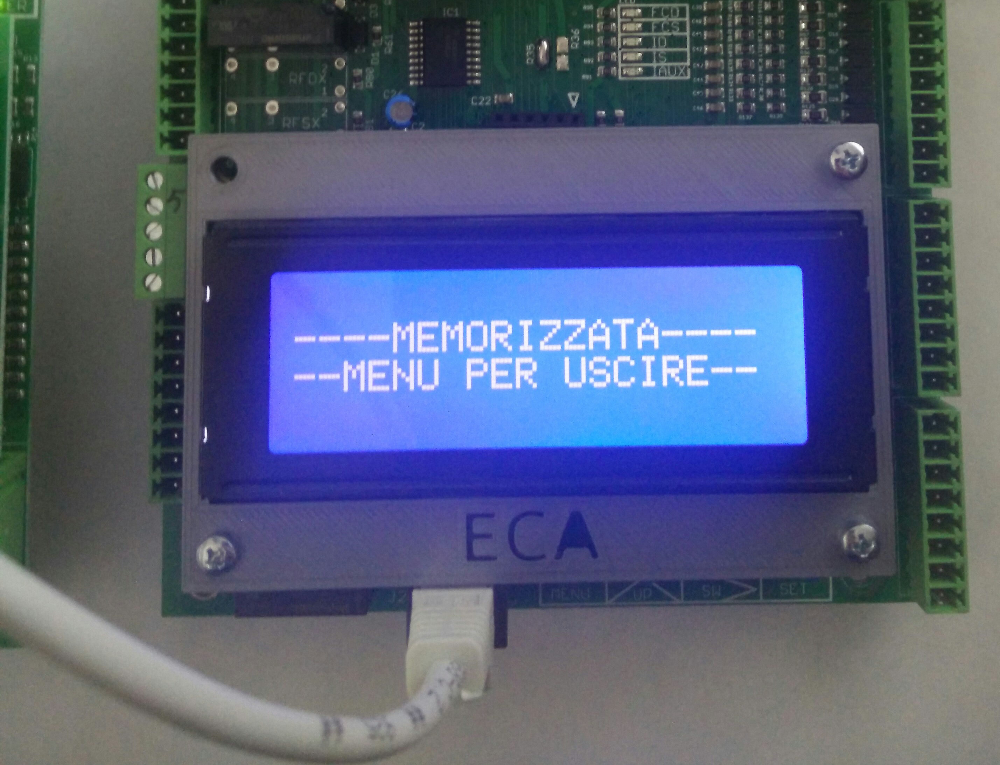

Dopo essere usciti, per rendere le modifiche attive bisogna __resettare la scheda MCP2015X-SMD__ (vedi [reset sistema](#reset-sistema)).

##### Periferica già programmata

Se la scheda PER16B-SMD è stata già programmata, nella schermata di memorizzazione verrà visualizzato l'indirizzo corrente.

È possibile a questo punto __modifcare__ l'indirizzo, tenendo a mente che __non è possibile memorizzare due schede con lo  stesso indirizzo__.
In tal caso la procedura fallisce.

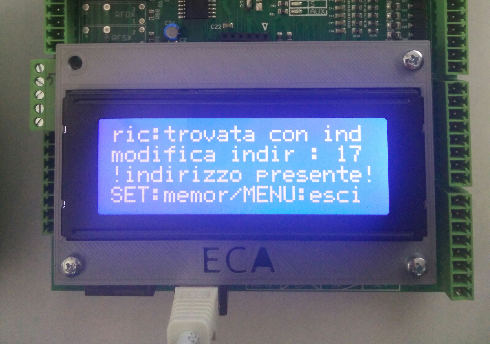

## Reset sistema (RESET SISTEMA) {#reset-sistema}

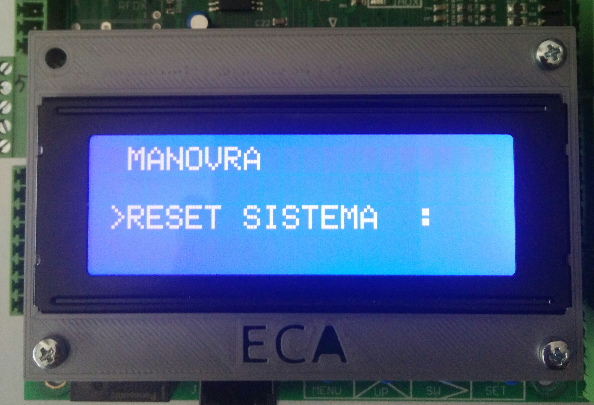

Riavvia il firmware.

Valore impostato|Effetto
--|--
S|La scheda viene riavviata
N|La scheda non viene riavviata

## Chiamate da pulsanti (chiamate da pulsanti up-sw-set) {#ch-puls}

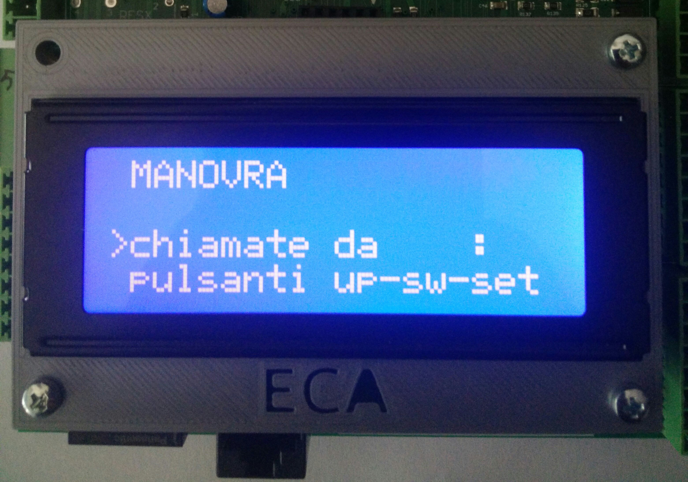

Permette di effettuare chiamate ad un piano specifico selezionato con i pulsanti UP, SW, SET.

--- Inserire procedura chiamate --------------

Valore impostato|Effetto
--|--
S|Le chiamate da pulsanti sono attivate
N|Le chiamate da pulsanti non sono attivate
