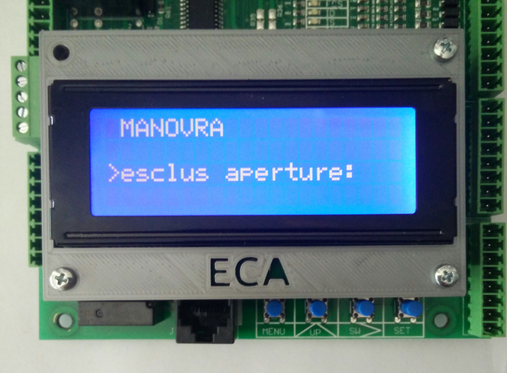

# Menu - manovra - comandi

Di seguito viene riportato l'elenco dei comandi disponibili e le loro funzioni.

## Esclusione apertura porte

Esclusione apertura delle porte.

Valore impostato|Effetto
--|--
S|Le porte non vengono mai aperte
N|Le porte vengono comandate normalmente
