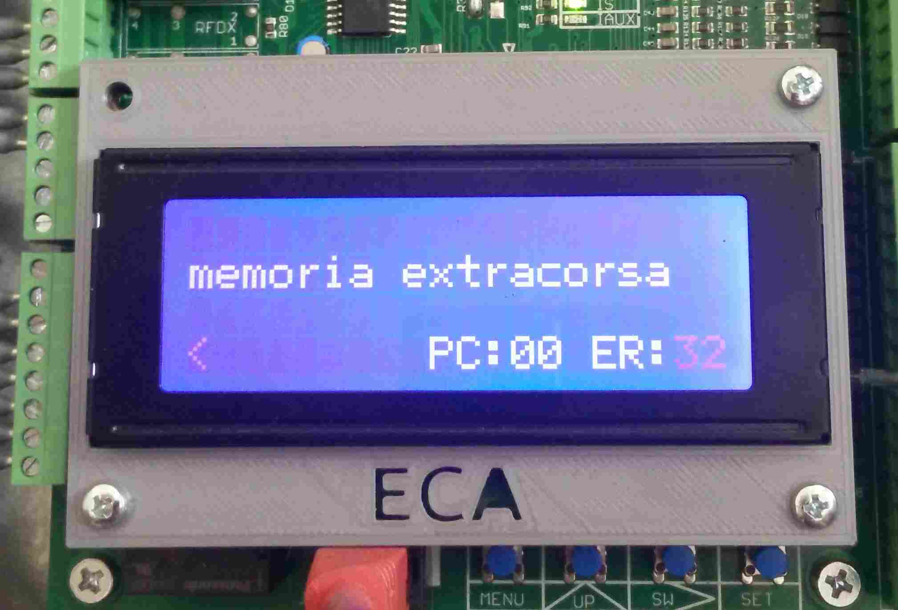
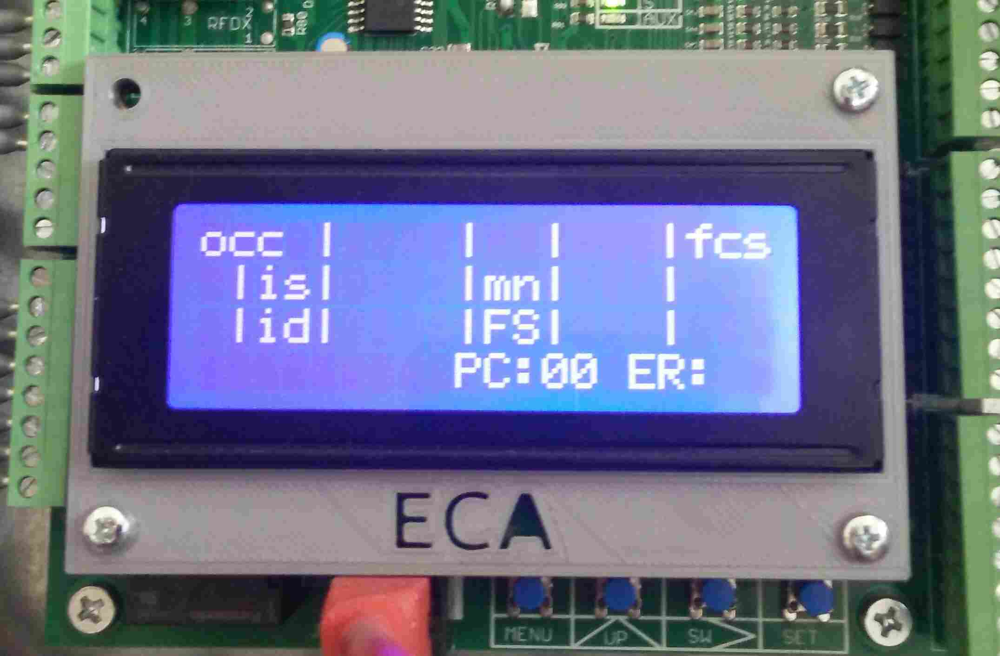
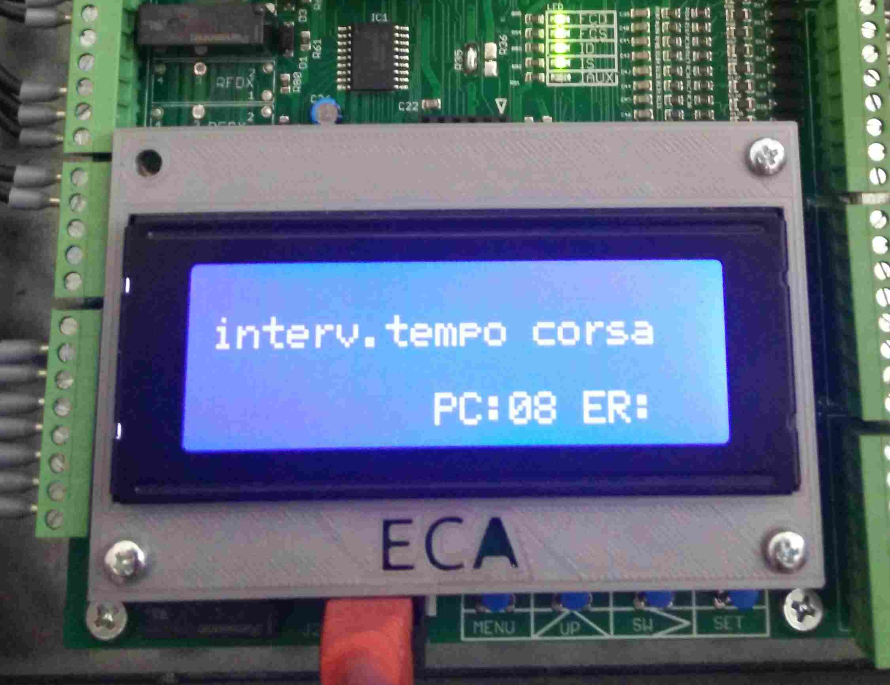

# Blocco per errore

Alcuni errori possono provocare il blocco dell'impianto e richiedere un intervento manuale per resettare
la scheda e/o rimuovere la causa d'errore per permettere il ritorno al funzionamento normale.

Fare riferimento all'[elenco](../menu/errori/elenco.md) per avere informazioni sugli errori, cause e soluzioni.

Gli errori che richiedono un intervento sulla scheda dopo aver rimosso la causa esterna sono riportati di seguito.

### Extracorsa (vedi [errore 008](../menu/errori/elenco.md#008))

A schermo viene alternata la pagina dello stato del quadro con la notifica dell'allarme dell'extracorsa.

 

Per riattivare l'impianto, dopo aver riportato la cabina nella situazione con extracorsa chiuso, resettare l'errore usando il comando di [reset extracorsa](../menu/manovra/comandi/README.md#res-extra) che si trova nella voce [manvora](../menu/manovra/README.md) del [menu](../menu/README.md).

### Tempo corsa (vedi [errore 064](../menu/errori/elenco.md#064))

A schermo viene riportata la notifica

Per resettare questo errore basta toglere e ridare alimentazione alla scheda, oppure entrare ed uscire dal [menu](../menu/README.md).
