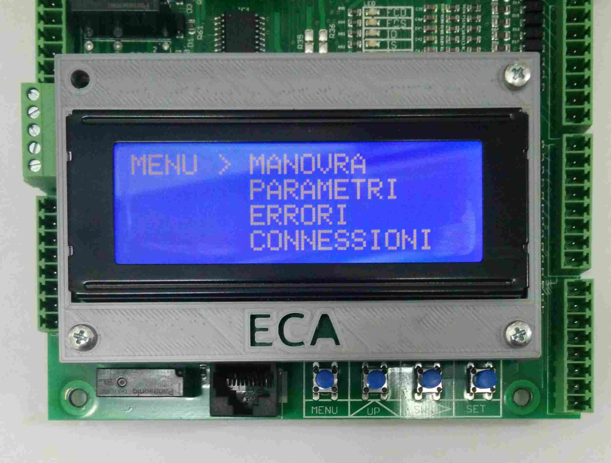

# Menu

Premendo per circa 4 secondi il tasto MENU si accede alla pagina del menu.

Questa presenta 4 voci:
*   [MANOVRA](./manovra/README.md)
*   [PARAMETRI](./parametri/README.md)
*   [ERRORI](./errori/README.md)
*   [CONNESSIONI](./connessioni/README.md)

Premendo il tasto UP si muove il cursore lungo le varie voci, premendo il tasto SET si entra
nella voce selezionata, premendo il tasto MENU si esce dal menu stesso.

Di seguito vengono descritte le voci in dettaglio.
