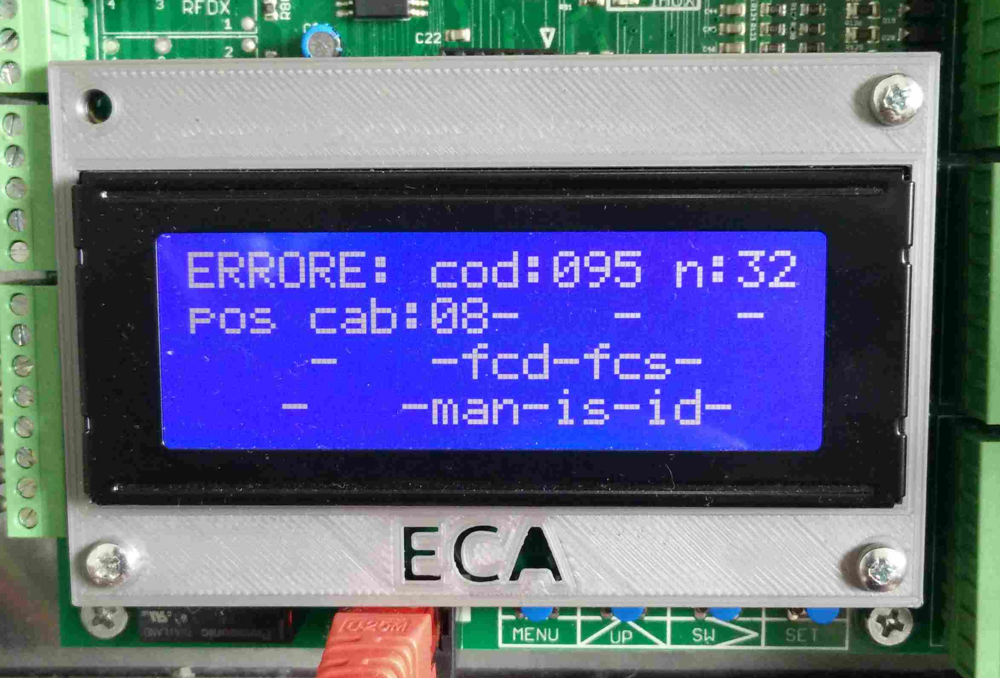
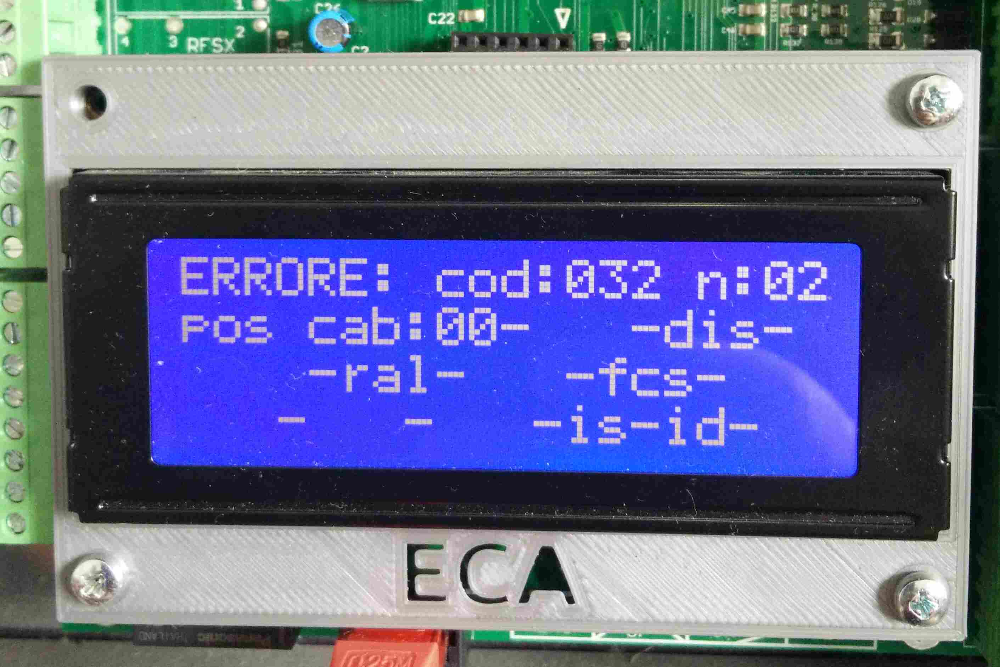

# Errori

Nella sezione errori viene riportata l'elenco degli ultimi errori che si sono verificati. Il numero massimo
è 32.

Ogni errore viene riportato in una pagina apposita.
È possibile scorrere da una pagina all'altra premendo il tasto UP. La prima pagina visualizzata è quella dell'ultimo errore che si è verificato, a seguire in ordine cronologico tutti gli altri.

Ogni pagina ha la seguente struttura

```
ERRORE: cod:xxx n:xx
pos cab:xx-sal-dis-
alta-rall-fcd-fcs-rif
rip-emr-man-is-id-ax
```

##### cod:xxx

Indica il codice dell'errore (vedi [elenco errori](./elenco.md)), al posto di `xxx` viene riportato un numero.

#### n:xxx

Indica il numero della pagina / errore. Al posto di `xxx` viene riportato un numero da `000` a `032`.

#### pos cab:xx-sal-dis

Indica la posizione della cabina e la direzione al momento dell'errore. Al posto di `xx` viene riportato un
numero da `00` a `32`, mentre a seconda della direzione viene indicato solo `sal` o `dis`.

Dicitura|Descrizione
---|---
pos cab:xx|posizione dell'impianto
sal|l'impianto andava in salita
dis|l'impianto andava in discesa

Per esempio

```
pos cab:08-sal-
```

indica che l'errore si è verificato al piano 8 in salita, mentre

```
pos cab:08-   -dis-
```

indica che l'errore si è verificato al piano 8 in dicsesa.

#### alta-rall-fcd-fcs-rif

Indica se la cabina si muoveva in alta o bassa velocità, lo stato dei finecorsa e se l'impianto
stava effettuando un rifasamento al momento dell'errore.

Dicitura|Descrizione
---|---
alta|l'impianto andava in alta velocità
rall|l'impianto andava in rallentamento
fcd|il finecorsa di discesa `FCD` era chiuso
fcs|il finecorsa di salita `FCS` era chiuso

Per esempio:

```
alta-   -fcd-fcs-rif
```

indica che l'impianto viaggiava in alta velocità, stava effettuando un rifasamento ed entrambi i finecorsa erano
chiusi

```
   -rall-   -fcs-
```

indica che l'impianto viaggiava in bassa velocità e il finecorsa di discesa era aperto.

#### rip-emr-man-is-id-ax

Indica se l'impianto effettuava un ripescaggio (impianti oleodinamici), era in emergenza o in manutenzione e lo stato degli induttori di fermata e per la gestione di piani corti estremi (IAX).

Dicitura|Descrizione
---|---
rip|l'impianto effettuava un ripescaggio
emr|l'impianto stava effettuando la procedura di emergenza
man|l'impianto era in manutenzione
is|l'induttore `IS` di fermata / rallentamento era chiuso
id|l'induttore `ID` di fermata / rallentamento era chiuso
ax|l'induttore `IAX` per gestione piani corti estremi era chiuso

Per esempio:

```
rip-   -   -  -id-
```

indica che l'impianto effettuava un ripescaggio e solo l'induttore `ID` era chiuso

```
   -emr-   -is-id-
```

indica che l'impianto stava effettuando la procedura d'emergenza ed entrambi gli induttori erano chiusi

```
   -   -man-  -  -
```

indica che l'impianto era in manutenzione ed entrambi gli induttori erano aperti.

-----

Ecco un esempio di alcune schermate di errore.

 
