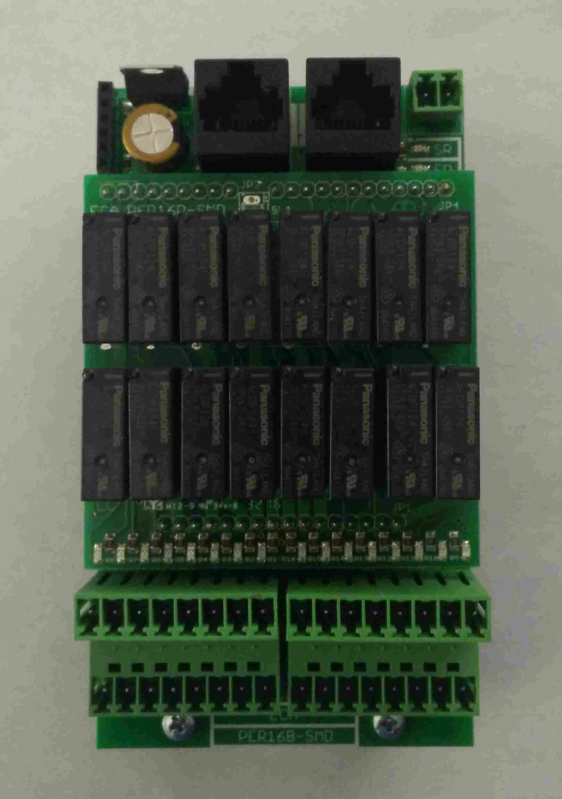
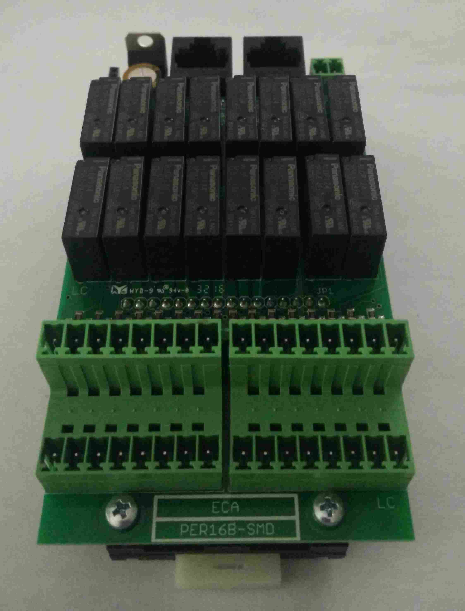
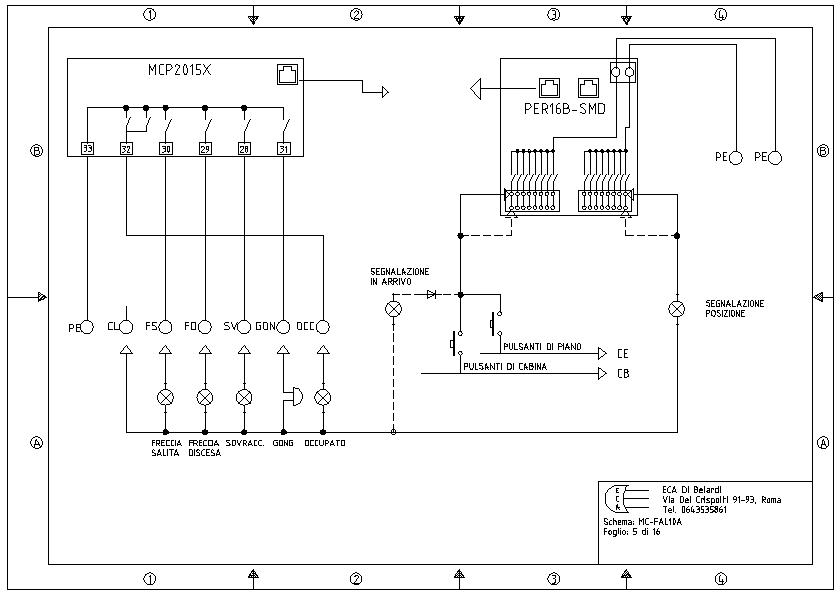

# Schede periferiche PER16B-SMD

Come già accennato nell'introduzione, le schede periferiche PER16B-SMD complementano la scheda madre MCP2015X-SMD con funzionalità aggiuntive.

Sono connesse con quest'ultima e tra di loro tramite un bus seriale apposito.

Sono fornite di due gruppi di 8 ingressi/uscite (in/out) che vengono configurati via software programmando un indirizzo specifico nella periferica stessa (vedi [comando memorizzazione periferica su scheda madre](../mcpx/menu/manovra/comandi/README.md#mem-ind)). Hanno in dotazione 2 connettori a 16 poli, uno per ogni gruppo di in/out. Le linee sono raddoppiate per permettere il collegamento di più fili sulla stessa linea, cioè i pin dei connettori che verticalmente occupano la stessa posizione sono collegati insieme.

Le uscite vengono pilotate dal gruppo di relè in dotazione e permettono di commutare una tensione di 24VDC. Il comune è selezionalbile tramite il connettore a 2 poli posto nell'angolo in alto a destra (se su tale connettore viene collegato il riferimento negativo dei 24VDC, in uscita si avrà il negativo).

Le due funzioni principali per cui le periferiche vengono utilizzate sono:

* ingressi per chiamate
* uscite per display

#### Chiamate

È __necessaria almeno una periferica__ che sia impostata per le __chiamate__ affinchè la scheda MCP2015X-SMD
possa gestire l'impianto.

In questa configurazione, metà oppure tutte le linee vengone usate come ingressi per le chiamate dell'impianto. Si può collegare la chiamata esterna ed interna di un piano su i due pin della stessa linea.

Dopo la chiamata, sulla stessa linea viene data in uscita la segnalazione di "in arrivo".
Quindi nel caso si abbia bisogno di tale segnalazione è sufficiente collegare la luminosa insieme alla chiamata interponendo un diodo per evitare ritorni di tensione (fare riferimento allo schema del quadro per maggiori informazioni).

###### Esempio collegamento

#### Display

In questa configurazione, metà oppure tutte le linee vengone usate come uscite pilotare un display che segnala la posizione dell'impianto. Sono gestiti vari tipi di display.

-----

Di seguito viene riportato l'elenco di tutti gli indirizzi disponibili e le relative funzioni.
