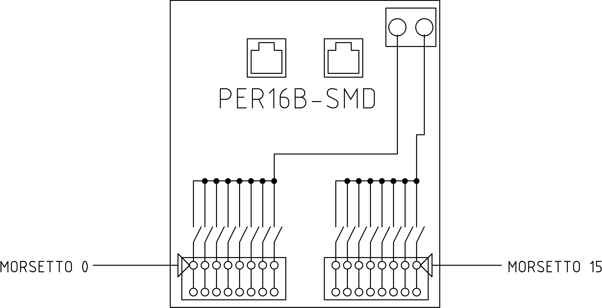

# Elenco indirizzi e funzioni

#### Numerazione morsetti {#numerazione-morsetti}

## Indirizzo 1

#### Funzione

Chiamate cabina da 0 a 15 in impianti con 16 fermate.

Dopo la chiamata, sulla stessa linea viene data in uscita la segnalazione di "in arrivo".
Quindi nel caso si abbia bisogno di tale segnalazione è sufficiente collegare la luminosa insieme alla chiamata interponendo un diodo per evitare ritorni di tensione (fare riferimento allo schema del quadro per maggiori informazioni e all'[esempio di collegamento](./README.md#esempio-collegamento)).

---

## Indirizzo 2

#### Funzione

Chiamate cabina da 16 a 31 in impianti con 32 fermate.

Dopo la chiamata, sulla stessa linea viene data in uscita la segnalazione di "in arrivo".
Quindi nel caso si abbia bisogno di tale segnalazione è sufficiente collegare la luminosa insieme alla chiamata interponendo un diodo per evitare ritorni di tensione (fare riferimento allo schema del quadro per maggiori informazioni e all'[esempio di collegamento](./README.md#esempio-collegamento)).

---

## Indirizzo 3

#### Funzione

Chiamate cabina lato 2 da 0 a 15 in impianti con accessi selettivi 16 fermate.

Dopo la chiamata, sulla stessa linea viene data in uscita la segnalazione di "in arrivo".
Quindi nel caso si abbia bisogno di tale segnalazione è sufficiente collegare la luminosa insieme alla chiamata interponendo un diodo per evitare ritorni di tensione (fare riferimento allo schema del quadro per maggiori informazioni e all'[esempio di collegamento](./README.md#esempio-collegamento)).

---

## Indirizzo 4

#### Funzione

Chiamate cabina lato 2 da 16 a 31 in impianti con accessi selettivi 32 fermate.

Dopo la chiamata, sulla stessa linea viene data in uscita la segnalazione di "in arrivo".
Quindi nel caso si abbia bisogno di tale segnalazione è sufficiente collegare la luminosa insieme alla chiamata interponendo un diodo per evitare ritorni di tensione (fare riferimento allo schema del quadro per maggiori informazioni e all'[esempio di collegamento](./README.md#esempio-collegamento)).

---

## Indirizzo 5

#### Funzione

Chiamate prenotazione salita da 0 a 15 in impianti con 16 fermate.

Dopo la chiamata, sulla stessa linea viene data in uscita la segnalazione di "prenotato".
Quindi nel caso si abbia bisogno di tale segnalazione è sufficiente collegare la luminosa insieme alla chiamata interponendo un diodo per evitare ritorni di tensione (fare riferimento allo schema del quadro per maggiori informazioni e all'[esempio di collegamento](./README.md#esempio-collegamento)).

---

## Indirizzo 6

#### Funzione

Chiamate prenotazione salita da 16 a 31 in impianti con 32 fermate.

Dopo la chiamata, sulla stessa linea viene data in uscita la segnalazione di "prenotato".
Quindi nel caso si abbia bisogno di tale segnalazione è sufficiente collegare la luminosa insieme alla chiamata interponendo un diodo per evitare ritorni di tensione (fare riferimento allo schema del quadro per maggiori informazioni e all'[esempio di collegamento](./README.md#esempio-collegamento)).

---

## Indirizzo 7

#### Funzione

Chiamate prenotazione salita da 0 a 15 lato 2 in impianti con accessi selettivi 16 fermate.

Dopo la chiamata, sulla stessa linea viene data in uscita la segnalazione di "prenotato".
Quindi nel caso si abbia bisogno di tale segnalazione è sufficiente collegare la luminosa insieme alla chiamata interponendo un diodo per evitare ritorni di tensione (fare riferimento allo schema del quadro per maggiori informazioni e all'[esempio di collegamento](./README.md#esempio-collegamento)).

---

## Indirizzo 8

#### Funzione

Chiamate prenotazione salita da 16 a 31 lato 2 in impianti con accessi selettivi 32 fermate.

Dopo la chiamata, sulla stessa linea viene data in uscita la segnalazione di "prenotato".
Quindi nel caso si abbia bisogno di tale segnalazione è sufficiente collegare la luminosa insieme alla chiamata interponendo un diodo per evitare ritorni di tensione (fare riferimento allo schema del quadro per maggiori informazioni e all'[esempio di collegamento](./README.md#esempio-collegamento)).

---

## Indirizzo 9

#### Funzione

Chiamate prenotazione discesa  da 0 a 15 in impianti con 16 fermate.

Dopo la chiamata, sulla stessa linea viene data in uscita la segnalazione di "prenotato".
Quindi nel caso si abbia bisogno di tale segnalazione è sufficiente collegare la luminosa insieme alla chiamata interponendo un diodo per evitare ritorni di tensione (fare riferimento allo schema del quadro per maggiori informazioni e all'[esempio di collegamento](./README.md#esempio-collegamento)).

---

## Indirizzo 10

#### Funzione

Chiamate prenotazione discesa da 16 a 31 in impianti con 32 fermate.

Dopo la chiamata, sulla stessa linea viene data in uscita la segnalazione di "prenotato".
Quindi nel caso si abbia bisogno di tale segnalazione è sufficiente collegare la luminosa insieme alla chiamata interponendo un diodo per evitare ritorni di tensione (fare riferimento allo schema del quadro per maggiori informazioni e all'[esempio di collegamento](./README.md#esempio-collegamento)).

---

## Indirizzo 11

#### Funzione

Chiamate prenotazione discesa da 0 a 15 lato 2 in impianti con accessi selettivi 16 fermate.

Dopo la chiamata, sulla stessa linea viene data in uscita la segnalazione di "prenotato".
Quindi nel caso si abbia bisogno di tale segnalazione è sufficiente collegare la luminosa insieme alla chiamata interponendo un diodo per evitare ritorni di tensione (fare riferimento allo schema del quadro per maggiori informazioni e all'[esempio di collegamento](./README.md#esempio-collegamento)).

---

## Indirizzo 12

#### Funzione

Chiamate prenotazione discesa da 16 a 31 lato 2 in impianti con accessi selettivi 32 fermate.

Dopo la chiamata, sulla stessa linea viene data in uscita la segnalazione di "in arrivo".
Quindi nel caso si abbia bisogno di tale segnalazione è sufficiente collegare la luminosa insieme alla chiamata interponendo un diodo per evitare ritorni di tensione (fare riferimento allo schema del quadro per maggiori informazioni e all'[esempio di collegamento](./README.md#esempio-collegamento)).

---

## Indirizzo 13

#### Funzione

Chiamate cabina da 0 a 7 lato 1 e da 0 a 7 lato 2 in impianti con accessi selettivi 8 fermate.

Dopo la chiamata, sulla stessa linea viene data in uscita la segnalazione di "in arrivo".
Quindi nel caso si abbia bisogno di tale segnalazione è sufficiente collegare la luminosa insieme alla chiamata interponendo un diodo per evitare ritorni di tensione (fare riferimento allo schema del quadro per maggiori informazioni e all'[esempio di collegamento](./README.md#esempio-collegamento)).

---

## Indirizzo 14

#### Funzione

Chiamate prenotazione salita da 0 a 7 lato 1 e da 0 a 7 lato 2 in impianti con accessi selettivi 8 fermate.

Dopo la chiamata, sulla stessa linea viene data in uscita la segnalazione di "prenotato".
Quindi nel caso si abbia bisogno di tale segnalazione è sufficiente collegare la luminosa insieme alla chiamata interponendo un diodo per evitare ritorni di tensione (fare riferimento allo schema del quadro per maggiori informazioni e all'[esempio di collegamento](./README.md#esempio-collegamento)).

---

## Indirizzo 15

#### Funzione

Chiamate prenotazione discesa da 0 a 7 lato 1 e da 0 a 7 lato 2 in impianti con accessi selettivi 8 fermate.

Dopo la chiamata, sulla stessa linea viene data in uscita la segnalazione di "prenotato".
Quindi nel caso si abbia bisogno di tale segnalazione è sufficiente collegare la luminosa insieme alla chiamata interponendo un diodo per evitare ritorni di tensione (fare riferimento allo schema del quadro per maggiori informazioni e all'[esempio di collegamento](./README.md#esempio-collegamento)).

---

## Indirizzo 16

#### Funzione

Chiamate cabina da 0 a 7 e segnalazione posizione o presente da 0 a 7 (da impostare su [parametro 33](../mcpx/menu/parametri/manovra.md#033)) in impianti con 8 fermate.

Dopo la chiamata, sulla stessa linea viene data in uscita la segnalazione di "in arrivo".
Quindi nel caso si abbia bisogno di tale segnalazione è sufficiente collegare la luminosa insieme alla chiamata interponendo un diodo per evitare ritorni di tensione (fare riferimento allo schema del quadro per maggiori informazioni e all'[esempio di collegamento](./README.md#esempio-collegamento)).

---

## Indirizzo 17

#### Funzione

Chiamate prenotazione salita da 0 a 7 e prenotazione discesa da 0 a 7 in impianti con 8 fermate.

Dopo la chiamata, sulla stessa linea viene data in uscita la segnalazione di "prenotato".
Quindi nel caso si abbia bisogno di tale segnalazione è sufficiente collegare la luminosa insieme alla chiamata interponendo un diodo per evitare ritorni di tensione (fare riferimento allo schema del quadro per maggiori informazioni e all'[esempio di collegamento](./README.md#esempio-collegamento)).

---

## Indirizzo 18

#### Funzione

Segnalazione posizione da 0 a 15 con codifica 1 filo per piano in impianti a 16 fermate.

---

## Indirizzo 19

#### Funzione

Segnalazione posizione da 16 a 31 con codifica 1 filo per piano in impianti a 32 fermate.

---

## Indirizzo 20

#### Funzione

Periferica ausiliaria segnalazione posizione da 0 a 15 con codifica 1 filo per piano in impianti a 16 fermate.

---

## Indirizzo 21

#### Funzione

Periferica ausiliaria segnalazione posizione da 16 a 31 con codifica 1 filo per piano in impianti a 32 fermate.

---

## Indirizzo 22

#### Funzione

Segnalazione posizione da 0 a 31 con codifica impostata su [parametro 33](../mcpx/menu/parametri/manovra.md#033) in impianti a 32 fermate.

---

## Indirizzo 23

#### Funzione

Gestione chiavi in impianti con manovra prioritaria o pompieri/antincendio.

---

## Indirizzo 24

#### Funzione

Segnalazione presente da 0 a 15 in impianti con 16 fermate.

---

## Indirizzo 25

#### Funzione

Segnalazione presente da 16 a 31 in impianti con 32 fermate.

---

## Indirizzo 41

#### Funzione

Ingressi su bus seriale.

Vedi [numerazione morsetti](#numerazione-morsetti).

Morsetto | Funzione
---|---
0  | partenza rapida
1  | cabina completa
2  | induttore IAUX
3  | FCS
4  | FCD
5  | IS
6  | ID
7  | costola mobile ingresso 1
8  | costola mobile ingresso 2
9  | sovraccarico
10  | manutenzione
11  | fondo mobile
12  | chiave cabina
13  | pulsante apertura per manovra pompieri
14  | finecorsa apertura porte per manovra pompieri

---

## Indirizzo 42

#### Funzione

Uscite su bus seriale.

Vedi [numerazione morsetti](#numerazione-morsetti).

Morsetto | Funzione
---|---
0  |  segnalazione gong
1  |  segnalazione freccia salita
2  |  segnalazione freccia discesa
3  |  segnalazione prossima partenza salita
4  |  segnalazione prossima partenza discesa
5  |  segnalazione fuori servizio
7  |  comune chiamate cabina per manovra pompieri
8  |  apertura porte ingresso 1
9  |  apertura porte ingresso 2
10  |  chiusura porte ingresso 1 e 2

---

## Indirizzo 47

#### Funzione

Gestione controllo contatti del freno su impianto a fune con emendamento A3.

Controllo batteria alimentazione dispositivo A3.
